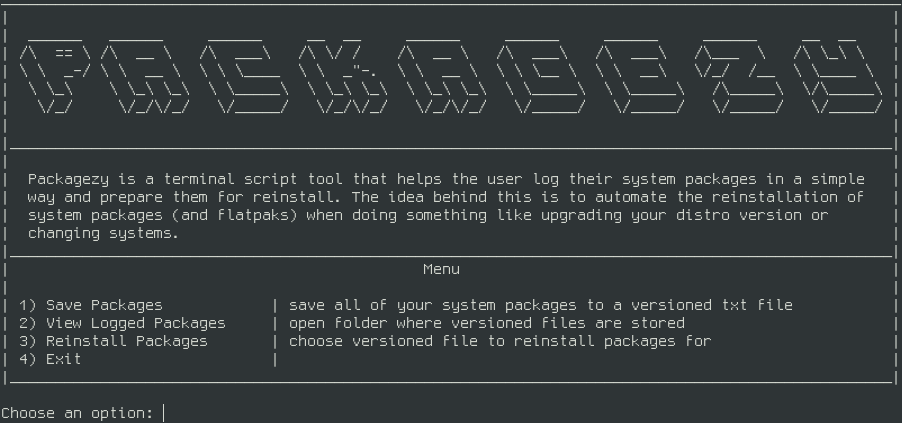

# NEEDS REWORK DO NOT USE
# Packagezy 
## Azzy's system package management tool!



## Description

Packagezy is just a simple bash script to help one manage their system packages in one place. It spawned from my constant distro hopping and upgrading of one distro to another or versions of a distro itself. Reinstalling my favorite packages became a task and I'd usually just use a list of my favorite packages and a few commands. Eventually I started doing this very often with my headless servers as well. Over time I just wanted to make a script that would handle it a little easier for me in the terminal and potentially automated down the line, hence this little project.

### Installing

* Just download and add execute permission (```chmod +x```) to main.sh and run it (```./main.sh```) 
* Place it in a place where you're okay with it sitting as I don't have a proper install/PATH edit procedure yet

## Version History

  * 1.0.0
    * Initial Release

## License

This project is licensed under the [GPLv3.0](https://github.com/AzzyB/Packagezy/blob/main/LICENSE) License - see the LICENSE.md file for details
